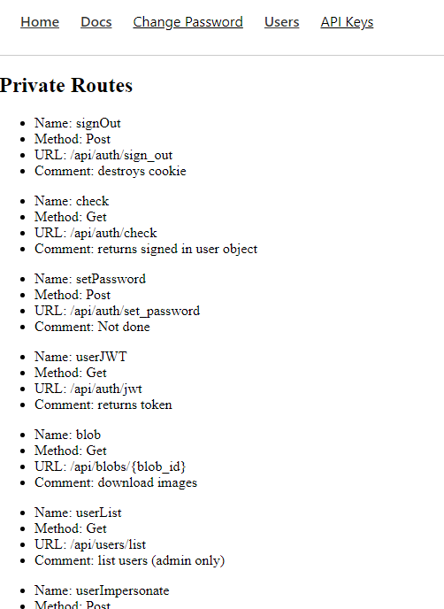
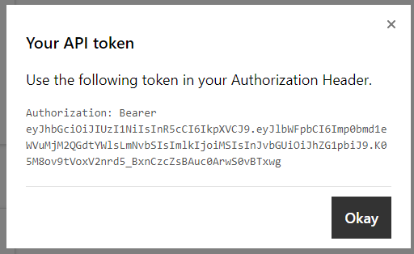
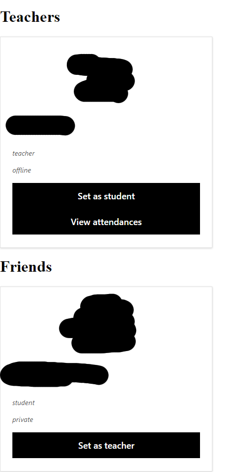
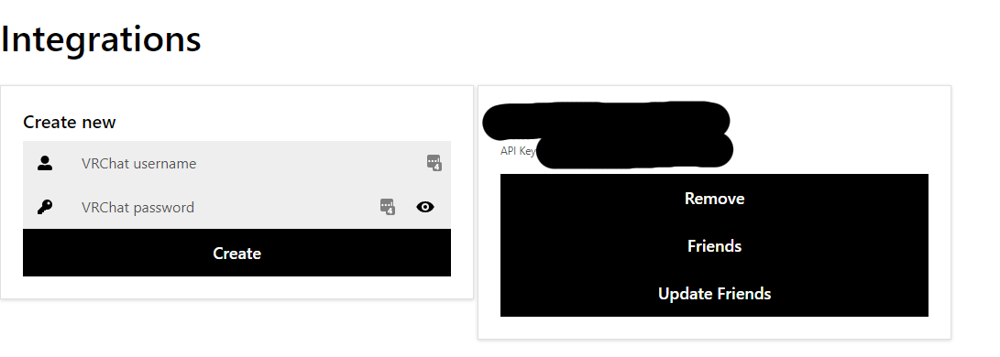
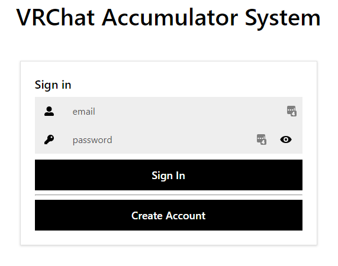
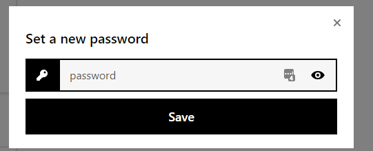
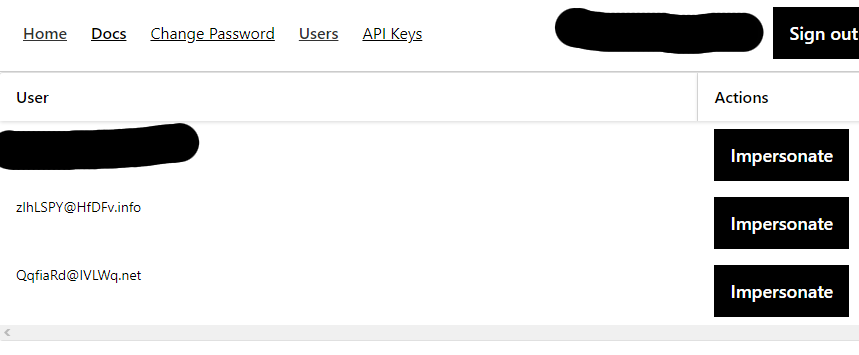

# Accumulator

Project Accumulator will track attendance rates per minute per student for VRChat classes. It is designed to be integrated via an API from another server.

API endpoints for developers.



API key for authentication.



A list of friends and teachers from the currently selected integration.



A list of integrations and the ability to add more using your VRChat username and password (API key is encrypted at rest, using [minio's implementation of  the DARE format](https://github.com/minio/sio)).



Sign in an existing acconut.



Change your password.



As admin, view and impersonate other users.




# Spinup

## Database

```bash
rm accumulator.db
# Embed migration bindata (ignore errors)
go generate
go run cmd/admin/main.go -db-migrate
# Generate SQLboiler
go generate
go run cmd/accumulator/main.go -db-seed
```


## Server

```bash
go run main.go
```

## Frontend

```bash
cd web
npm install
npm start
```
